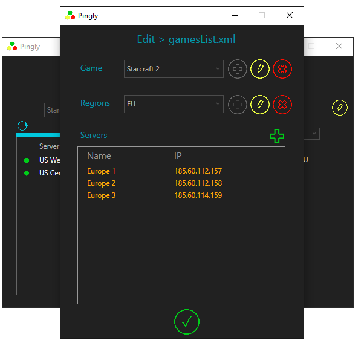

## Pingly
Pingly is a windows desktop application designed to help organize, and assess a player's connection speed to game servers. The program will test your latency (m/s) to the given servers, and display them in a sortable list. The file containing the list of games can be modified within the program to allow for customization.

/Deploy contains the Application installation files and running executable.

/Pingly contains the source code.

